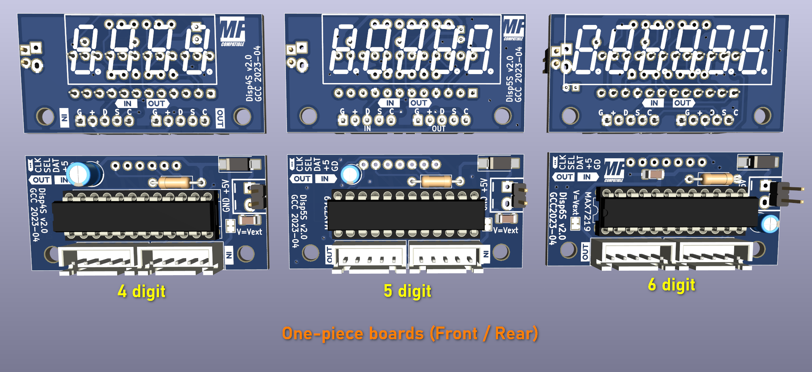
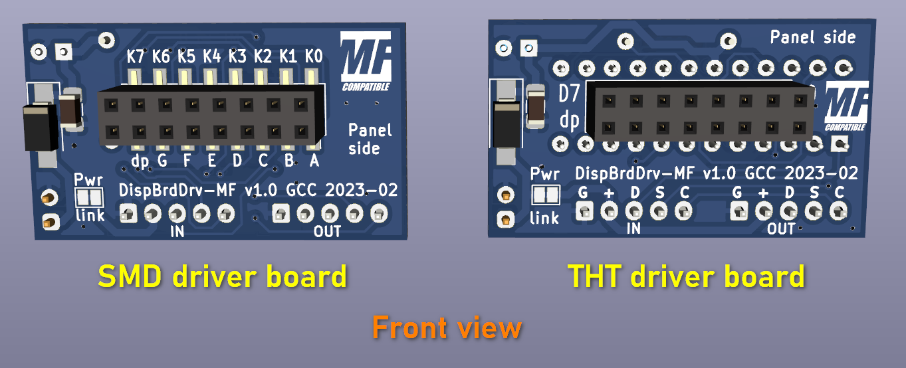
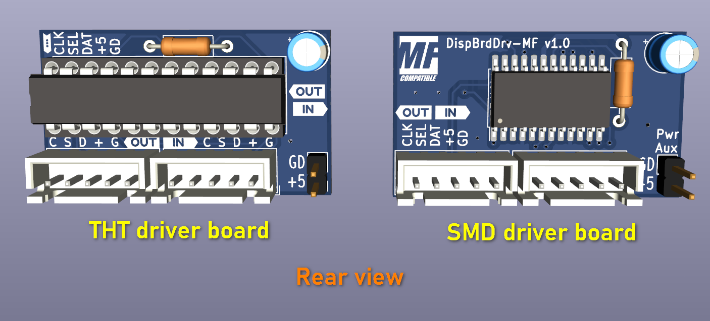
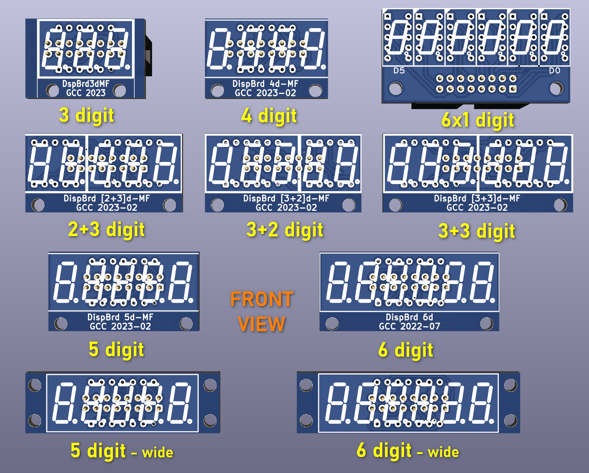
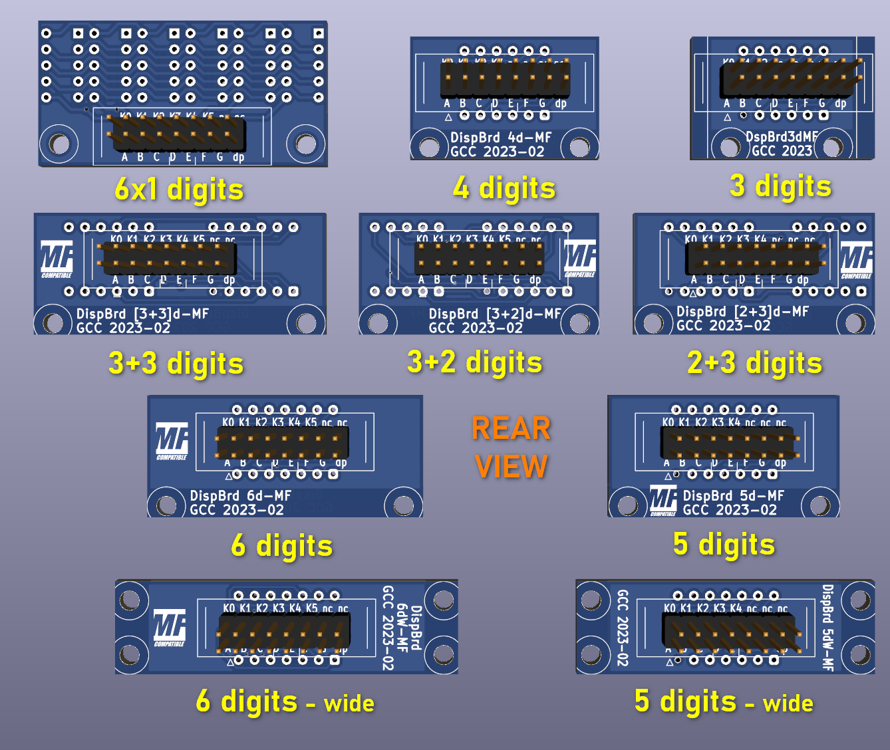

## General description

This repository contains the [KiCad](https://www.kicad.org/) projects (Schematics, PCBs, Gerber files) for a variety of generic 3- to 6-digit display panels.

There are two types of designs:

- _One-piece_: a complete panel with driver and 7-segment displays
- _Modular_: a separate driver board that fits any of the several digit carrier boards.  
  The driver board can be mounted "piggyback" behind the digit board, or connected through an IDC flat cable;  
  the digit boards can also be used in combination with the [MAX7219 Breakout System board](https://github.com/MobiFlight/mobiflight-pcbs/blob/main/max7219-breakout-system/README.md).

>_Important note: these designs are an evolution of those previously uploaded in the [mobiflight-panels/pcb-modules/max-displays](https://github.com/MobiFlight/mobiflight-panels/tree/main/pcb-modules/max-displays) section._  
>_This new version has following differences:_
>
>- _the digit board connector pinout is compatible with the other community display boards in the [mobiflight-pcbs](https://github.com/MobiFlight/mobiflight-pcbs) section (also featured in the MobiFlight shop)_
>- _the input/output connector has been changed to the standard XH type._
> _Also, a 2+3d board has been added (can be used for 3 or 5 digits, even though in that case - space permitting - a 3+3 board would optimize component purchase)._

New MF-standard pinout (as seen on the __digit__ board on the rear side):

| | | | | | | | |  |
|-|--|--|--|--|--|--|--|--|
||K0|K1|K2|K3|K4|K5|K6|K7|
|Pin 1>|__sA__|sB|sC|sD|sE|sF|sG|dp|

Notice the position of pin 1, to be regarded when using an IDC F-F cable.

## Common features

- __MAX7219__ drivers _(DIP for one-piece, DIP or SMD variants for modular)_
- __0.36" LED displays__
- Several combinations of display components for a given number of digits _(see list below)_

## Display Variants

The LED display types to be mounted are listed below for each variant.

## Connections: In/Out

The input / output connectors as clearly marked on the PCB (as much as possible, considering the size).
This is the pinout:

|Pin No.| |1|2|3|4|5|
|-|-|--|--|--|--|--|
|Signal||GND|+5V|Data In (Out)|Sel/Lat|Clock|

Multiple boards can be chained by connecting the "Out" connector of the first board to the "In" connector of the second board ans so on.

## Connections: Power

These modules are powered with a __5V__ (max 5.5V) power supply.  
Normally, in a chain, power is passed from one module to the others following in the chain through the signal connectors (with __no__ additional drop due to internal diodes, unlike the common MAX modules).  
However, __for chains of more than 2 modules it is warmly advised to wire the power lines separately to each module__, making use of the additional auxiliary power terminals provided.  
For power rating, please consider an average of about __160mA__ per module.

### One-piece design

- 1x 4-digit
- 1x 5-digit
- 1x 6-digit

### Modular design - Driver boards

### Modular design - Digit boards

- 1x 3-digit
- 1x 4-digit
- 1x 5-digit
- 1x 6-digit
- 1x 5-digit, side mounting holes
- 1x 6-digit, side mounting holes
- 1x 3-digit + 1x 2-digit
- 1x 2-digit + 1x 3-digit
- 2x 3-digit
- 6x 1-digit

## Components

Beside the MAX7219 ICs and the LED displays of the chosen types, other components required are:

|Qty |Value |Desc |
|-----|-------|------|
| 1x |10uF/16V THD |Electrolytic capacitor|
| 1x |100nF 1206 SMD |Ceramic capacitor (MLCC)|
| 1x |10k 0.25W THD|Resistor (*)|
| 1x |SS14 or 1N5819|SMD Schottky diode|
| 2x |XH-2.50-5p | XH Male connectors, 5 pole (just 1x if chaining is not required)|
| 1x |0.1" |Female header strips, tulip type (for display sockets)|
| 1x |0.1" 2x8p F|(for __driver boards__ only) Female header connector, SMD or THD version|
| 1x |0.1" 2x8p M|(for __digit boards__ only) Male header connector, THD|

_(*) The resistor value might have to be adjusted according to the displays used, in order to obtain the desired brightness; please refer to the MAX7219 datasheet for further details._

### Notes about components

- ___Displays must be common CATHODE.___
- some LED display sizes have compatible pinout, in particular:
  - A __3-digit display__ can be mounted in place of a __4- or 5-digit display__, but _the rightmost digit will then correspond to digit #2 or #3_ (i.e. 1 or 2 rightmost digits are lost)
  - A __4-digit display__ can be mounted in place of a __5-digit display__; same caveats as above.
- On __digit boards__, male header connectors (strips) are preferred.  
Since these boards can also be attached to a [MAX7219 Breakout System board](https://github.com/MobiFlight/mobiflight-pcbs/blob/main/max7219-breakout-system/README.md) by means of a flat cable, IDC male (box) connectors can also be used; however, their footprint is slightly larger and can interfere with the display socket soldering pads.
- XH connectors can be replaced by common 0.1" strip male headers (although they're not recommended for final installations).

### Notes about design files

The designs can be opened and modified with [_KiCad version 6_](https://downloads.kicad.org/kicad/windows/explore/stable/download/kicad-6.0.10-x86_64.exe) (or any more recent version).

KiCad is not required if you are just interested in having the PCBs manufactured; a .zip with set of ready Gerber files is provided (compliant with the requirements of the JLCPCB online ordering service, but also of other online services). However, having KiCad installed allows you to modify the design, reissue the Gerber files and check them with the integrated Gerber viewer.

Each set of design files contains _one_ single type of board.  
If several types are desired (or a larger number of boards of the same type), with little or no additional expense, it is advisable to compose a custom PCB layout by copying several PCB drawings in a single production file.
It is then up to the user to decide whether it is more convenient to order pre-cut boards (through V-scoring or milling), or to cut them by him/herself.  
_In this latter case, please beware that the dust from PCB cutting is hazardous for your health, and proper precautions must be taken to prevent inhaling it._

### License

  
This work is licensed under a [Creative Commons Attribution-ShareAlike 4.0 International License](http://creativecommons.org/licenses/by-sa/4.0/).

_If you find an error or a problem in any of the designs, please let me know at g (dot) crocic (at) gmail (dot) com. Thank you!_
